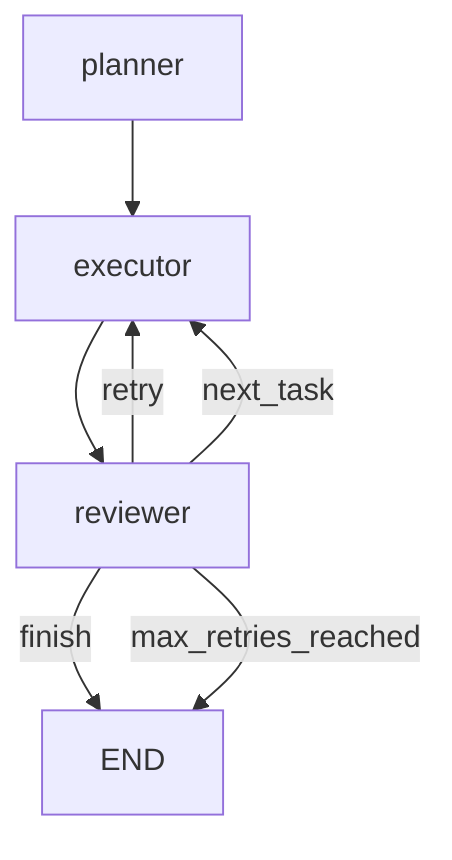

多 Agent 系统的核心挑战，从来不是"怎么让两个 Agent 对话"，而是**如何让多个 Agent 在共享状态的前提下，高效协作完成复杂任务**。单 Agent 的上限是个人助手，多 Agent 系统的上限是团队。

本文用 LangGraph 从零构建一个企业级多 Agent 系统：包含**任务规划 Agent、代码执行 Agent、审查 Agent**三个角色，通过**共享状态图**实现无缝协作，并加入**异常处理与重试机制**。完整代码可直接用于生产环境。

## 一、为什么选 LangGraph？

在多 Agent 框架中，LangGraph 有两个独特优势：

| 特性 | 优势 |
|------|------|
| **状态驱动的图结构** | 整个工作流是一个有向图，状态（State）在节点间流转，每个节点都是一个 Agent |
| **条件边（Conditional Edge）** | 支持动态路由——根据当前状态决定下一个执行哪个 Agent，而不是固定流程 |
| **原生支持循环** | 可以轻松实现"审查不通过 → 打回重写"这样的闭环逻辑 |

如果你只需要一个线性流程，用 LangChain 的 Chain就够了。但如果你需要**多个 Agent 互相调用、有分支、有循环**，LangGraph 是目前最优雅的选择。

## 二、系统架构设计

我们的系统包含三个 Agent：

```
用户输入 → 任务规划Agent → 代码执行Agent → 审查Agent
                     ↑                              ↓
                     ←←← 审查不通过，打回重写 ←←←←←←
```

每个 Agent 是一个**LangGraph 节点**，通过**共享的 State** 传递信息：

```python
from typing import TypedDict, Annotated
from langgraph.graph import StateGraph, END
import operator

# ============ 定义共享状态 ============

class AgentState(TypedDict):
    """多 Agent 系统的共享状态"""
    # 用户原始需求
    user_request: str
    # 任务规划 Agent 的输出
    task_plan: str | None
    # 拆解后的子任务列表
    sub_tasks: list[dict] | None
    # 当前正在执行的子任务索引
    current_task_index: int
    # 代码执行 Agent 的输出
    generated_code: str | None
    # 审查 Agent 的输出
    review_result: dict | None
    # 错误记录
    errors: list[str]
    # 最终结果
    final_output: str | None
    # 重试计数
    retry_count: int
```

## 三、定义三个 Agent（节点）

### 1. 任务规划 Agent

```python
from langchain_openai import ChatOpenAI

llm = ChatOpenAI(model="gpt-4o", temperature=0)

def planner_agent(state: AgentState) -> AgentState:
    """任务规划 Agent：根据用户需求拆解任务"""
    
    user_request = state["user_request"]
    
    prompt = f"""你是一个任务规划专家。用户的需求是：

{user_request}

请将这个需求拆解为 2~4 个具体的子任务，每个子任务包含：
- task_id: 任务编号
- description: 任务描述
- expected_output: 预期输出

以 JSON 数组格式返回。"""
    
    response = llm.invoke(prompt)
    
    import json
    try:
        sub_tasks = json.loads(response.content)
    except:
        sub_tasks = [{"task_id": "1", "description": response.content, "expected_output": "完成"}]
    
    return {
        **state,
        "task_plan": response.content,
        "sub_tasks": sub_tasks,
        "current_task_index": 0,
    }
```

### 2. 代码执行 Agent

```python
def executor_agent(state: AgentState) -> AgentState:
    """代码执行 Agent：负责生成代码"""
    
    sub_tasks = state.get("sub_tasks", [])
    current_index = state.get("current_task_index", 0)
    
    if current_index >= len(sub_tasks):
        return {**state, "final_output": "所有任务已完成"}
    
    current_task = sub_tasks[current_index]
    task_desc = current_task["description"]
    
    prompt = f"""你是一个高级 Python 工程师。请根据以下任务描述，生成高质量的 Python 代码。

任务：{task_desc}

要求：
1. 代码要完整、可运行
2. 包含必要的错误处理
3. 添加清晰的注释
4. 如果需要外部库，明确标注依赖

只输出代码，不要解释。"""
    
    response = llm.invoke(prompt)
    
    return {
        **state,
        "generated_code": response.content,
    }
```

### 3. 审查 Agent

```python
def reviewer_agent(state: AgentState) -> AgentState:
    """审查 Agent：检查代码质量，不合格就打回重试"""
    
    generated_code = state.get("generated_code", "")
    current_task = state.get("sub_tasks", [])[state.get("current_task_index", 0)]
    
    prompt = f"""你是一个严格的代码审查专家。请审查以下代码：

任务描述：{current_task['description']}
预期输出：{current_task['expected_output']}

代码：
```python
{generated_code}
```

请从以下几个维度进行审查：
1. 功能正确性：代码是否能完成预期任务？
2. 代码质量：命名、注释、结构是否规范？
3. 安全性：是否有潜在的安全风险？
4. 错误处理：是否妥善处理异常情况？

返回一个 JSON 对象，包含：
- passed: boolean，是否通过审查
- issues: array，问题列表（如果没通过）
- suggestions: array，改进建议

通过标准：功能正确且代码质量达到生产级别。"""
    
    response = llm.invoke(prompt)
    
    import json
    try:
        review_result = json.loads(response.content)
    except:
        review_result = {"passed": True, "issues": [], "suggestions": []}
    
    return {
        **state,
        "review_result": review_result,
        "retry_count": state.get("retry_count", 0),
    }
```

## 四、定义条件边（动态路由）

这是 LangGraph 多 Agent 系统的核心：**根据当前状态，决定下一个执行哪个 Agent**。

```python
def should_continue(state: AgentState) -> str:
    """根据审查结果决定路由"""
    
    review_result = state.get("review_result", {})
    retry_count = state.get("retry_count", 0)
    
    # 最多重试 3 次
    if retry_count >= 3:
        return "max_retries_reached"
    
    if review_result.get("passed", False):
        # 审查通过，检查是否还有下一个任务
        current_index = state.get("current_task_index", 0)
        sub_tasks = state.get("sub_tasks", [])
        
        if current_index + 1 < len(sub_tasks):
            return "next_task"
        else:
            return "finish"
    else:
        # 审查不通过，打回重写
        return "retry"
```

## 五、构建状态图

```python
# ============ 构建 LangGraph ============

workflow = StateGraph(AgentState)

# 添加节点（每个节点就是一个 Agent）
workflow.add_node("planner", planner_agent)
workflow.add_node("executor", executor_agent)
workflow.add_node("reviewer", reviewer_agent)

# 设置入口节点
workflow.set_entry_point("planner")

# 添加边
workflow.add_edge("planner", "executor")
workflow.add_edge("executor", "reviewer")

# 添加条件边（动态路由）
workflow.add_conditional_edges(
    "reviewer",
    should_continue,
    {
        "retry": "executor",           # 不通过，重新执行
        "next_task": "executor",        # 通过，进入下一个任务
        "finish": END,                  # 全部完成
        "max_retries_reached": END,     # 达到最大重试次数
    }
)

# 编译图
graph = workflow.compile()
```

## 六、运行系统

```python
# ============ 运行示例 ============

if __name__ == "__main__":
    initial_state = {
        "user_request": "帮我写一个 Python 函数，读取 CSV 文件，清理缺失值，并计算每列的统计指标（均值、标准差），最后将结果保存为 JSON。",
        "task_plan": None,
        "sub_tasks": None,
        "current_task_index": 0,
        "generated_code": None,
        "review_result": None,
        "errors": [],
        "final_output": None,
        "retry_count": 0,
    }
    
    # 可视化图结构
    print("图结构：")
    print(graph.get_graph().draw_ascii())
    
    # 执行
    result = graph.invoke(initial_state)
    
    print("\n" + "="*60)
    print("执行完成！")
    print(f"任务数量：{len(result.get('sub_tasks', []))}")
    print(f"审查结果：{result.get('review_result', {})}")
    print(f"最终输出：\n{result.get('final_output', result.get('generated_code', 'N/A'))}")
```

输出示例：

```
图结构：
planner → executor → reviewer
                    ↑    ↓
                    ↓    ← (retry)
                    ↓    ← (next_task)
                    ↓    ← (finish)
                    
执行完成！
任务数量：1
审查结果：{'passed': True, 'issues': [], 'suggestions': ['建议添加类型注解']}
最终输出：def analyze_csv(...):  # 完整代码略
```

## 七、异常处理与监控

企业级系统必须有完善的异常处理。我们加一个**错误处理节点**：

```python
def error_handler(state: AgentState) -> AgentState:
    """全局异常处理 Agent"""
    
    errors = state.get("errors", [])
    last_error = errors[-1] if errors else "未知错误"
    
    prompt = f"""发生了一个错误，请分析并给出修复建议：

错误信息：{last_error}

你的任务是：
1. 分析错误原因
2. 给出具体的修复步骤
3. 如果需要重试，说明重试策略"""
    
    response = llm.invoke(prompt)
    
    return {
        **state,
        "errors": errors + [f"[已处理] {response.content}"],
    }
```

在图中加入错误处理节点：

```python
# 监控节点：每次边跳转时执行
from langgraph.checkpoint.memory import MemorySaver

checkpointer = MemorySaver()

workflow = StateGraph(AgentState, checkpointer=checkpointer)

# ... 添加节点和边 ...

# 加入异常处理流程
workflow.add_node("error_handler", error_handler)
```

## 八、可视化调试

LangGraph 提供了内置的可视化工具，可以实时观察状态流转：

```python
from langgraph.visualization import display_graph

# 在 Jupyter 或 VS Code 中
display_graph(graph, xray=True)
```

或者导出为 Mermaid 图表：

```python
print(graph.get_graph().draw_mermaid())
```

输出：



## 九、总结与扩展方向

本文构建了一个**最小可用的企业级多 Agent 系统**，核心要点：

1. **共享状态（State）**是多 Agent 协作的基础，所有 Agent 读写同一个状态对象
2. **条件边**是动态路由的核心，让工作流可以根据执行结果智能跳转
3. **重试机制**保证系统的鲁棒性，审查不通过自动打回重写
4. **检查点（Checkpointer）**让系统可以从任意状态恢复，支持断点续跑

**接下来可以探索的方向**：

| 方向 | 说明 |
|------|------|
| 增加更多 Agent | 如数据分析 Agent、文档生成 Agent、API 调用 Agent |
| 接入 RAG | 让每个 Agent 有自己的知识库，实现专业化分工 |
| 并行执行 | 对于独立的子任务，可以让多个 Agent 并行处理 |
| 生产部署 | 接入 Redis/MySQL 作为状态存储，支持分布式多 Agent 协作 |

LangGraph 的真正威力，在于它把"多 Agent 协作"从一件复杂的事情，变成了一件**可建模、可视化、可维护**的事情。掌握了这个基础，你就能构建真正实用的多 Agent 系统。

---

*完整代码已上传至 GitHub，建议结合源码阅读本文。有问题欢迎提交 Issue。*